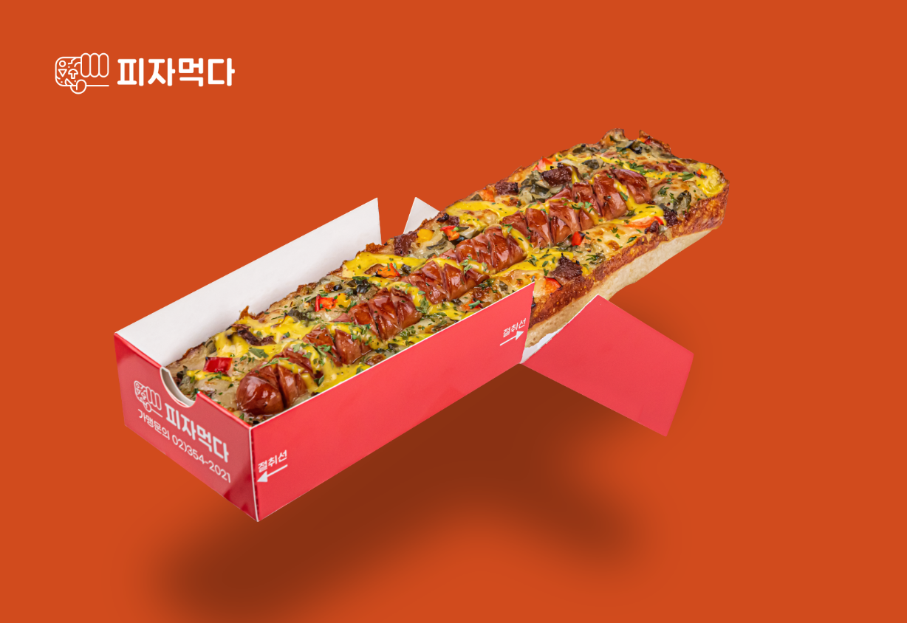

# Eat Pizza

## Description

This project is a Landing Page for a Frenchise called Eat Pizza that's have a big inovation for new shape Pizza in Rectangle, built using **Astro.js** and **Tailwind CSS**. It features a modern design with responsive layouts and smooth scrolling animations. The website aims to give best experience for users, and Gen-Z targeting modern and fun design style.

## Table of Contents

- [Features](#features)
- [Technologies](#technologies)

## Features

- Responsive design using Tailwind CSS
- Smooth scrolling animation
- Contact form integrate with Google Sheet
- Good SEO Optimization

## Technologies

- **Astro.js** - A modern static site generator
- **Tailwind CSS** - A utility-first CSS framework
- And Any other technologies used, JavaScript libraries, plugins
